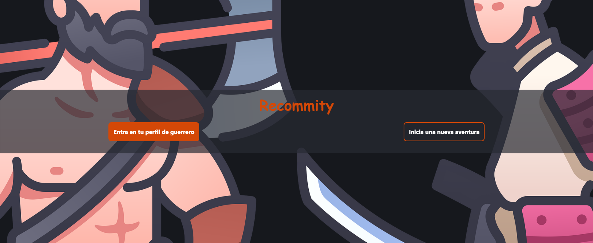

# Recommity

    

## About The Project

Idea de proyecto, sin acabar, sobre una tarjeta con todos tus datos profesionales, redes sociales, contacto, proyectos e ideas, reunido todo en un mismo lugar, para compartir con otros profesionales y empresas.

Para acceder al proyecto, tienes que abrir la terminal del proyecto y poner el siguiente comando:   npm start

------------------------------------------------------------------------------------------------------------------------

Project idea, unfinished, on a card with all your professional information, social networks, contact, projects and ideas, all gathered in one place, to share with other professionals and companies.

To access the project, you have to open the project terminal and type the following command: npm start

## Website screenshot

    

## Contact

Guillermo Pérez - [LinkedIn](https://linkedin.com/in/guillermo-perez-fuentes)
Portfolio - [The Bulliam](https://thebulliam.com)